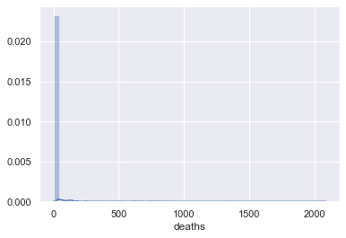
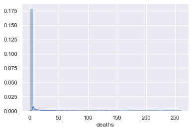
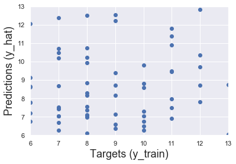
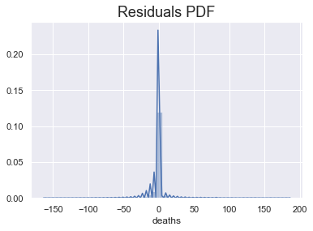
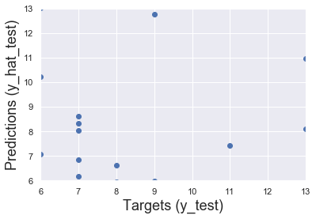

# Machine Learning and COVID-19
## When we apply multiple regression to death, cases and country data, what do we learn about different countries and their approach to Coronavirus? 
So, the main aim here is to take a very basic approach and use it to look at the differences that countries make to the predicted deaths they have. Beware the things we learn from this are entirely contextual and it only means something if you understand the numbers we are using and the real-world situation. 

What is the plan? Applying machine learning to create regression estimates for death data per data across all countries, we can find out if certain countries expect more deaths even when the cases increases (so, general infection levels) is taken into account. By looking at this we can get an idea of two things, the efficacy of certain country's strategies and the discrepancy in testing strategies across certain countries. The difference between these two is not clear even post-analysis so this is an interesting case study in how we can have different explanations for the same results (higher coefficients for certain countries). 

What is the analysis? I have, in my quarantine-driven boredom, made some progress in something I set out to do a long time ago. That was to learn Python and data analytics using it. I have just learned some very (very very!) basic machine learning techniques. These techniques can be applied to COVID data and tell at least a little. The analysis itself uses by-day data for cases and deaths seperated for each country. 

What is interesting is this data is open to anyone who might like to use it. What is more interesting is how hard it is to understand. Because cases, deaths and country generally show a similar trend (with cases and deaths going in similar directions), we have a basic understanding of what the data is saying, but we don't know what more we might learn from parsing these things apart and looking at how bad and disproportionate deaths are compared to every other country! This is why machine learning can be so effective, when we have huge numbers of categorical variables, such as country IDs, the machine learning can do the looking for us. Exciting!


```python
# For this practical example we will need the following libraries and modules
import numpy as np
import pandas as pd
import statsmodels.api as sm
import matplotlib.pyplot as plt
from sklearn.linear_model import LinearRegression
import seaborn as sns
sns.set()
```

We've loaded in the data, now it is time to look at the data and start cleaning it up. We will begin by removing all NAs. 


```python
# Load the data from a .csv in the same folder
raw_data = pd.read_csv('COVID.csv')

# Let's explore the top 5 rows of the df
raw_data.head()
```


```python
raw_data.describe(include='all')
```


<div>
<style scoped>
    .dataframe tbody tr th:only-of-type {
        vertical-align: middle;
    }

    .dataframe tbody tr th {
        vertical-align: top;
    }

    .dataframe thead th {
        text-align: right;
    }
</style>
<table border="1" class="dataframe">
  <thead>
    <tr style="text-align: right;">
      <th></th>
      <th>dateRep</th>
      <th>day</th>
      <th>month</th>
      <th>year</th>
      <th>cases</th>
      <th>deaths</th>
      <th>countriesAndTerritories</th>
      <th>geoId</th>
      <th>countryterritoryCode</th>
      <th>popData2018</th>
    </tr>
  </thead>
  <tbody>
    <tr>
      <td>count</td>
      <td>10332</td>
      <td>10332.000000</td>
      <td>10332.000000</td>
      <td>10332.000000</td>
      <td>10332.000000</td>
      <td>10332.000000</td>
      <td>10332</td>
      <td>10303</td>
      <td>10127</td>
      <td>1.016900e+04</td>
    </tr>
    <tr>
      <td>unique</td>
      <td>104</td>
      <td>NaN</td>
      <td>NaN</td>
      <td>NaN</td>
      <td>NaN</td>
      <td>NaN</td>
      <td>206</td>
      <td>205</td>
      <td>201</td>
      <td>NaN</td>
    </tr>
    <tr>
      <td>top</td>
      <td>12/04/2020</td>
      <td>NaN</td>
      <td>NaN</td>
      <td>NaN</td>
      <td>NaN</td>
      <td>NaN</td>
      <td>France</td>
      <td>SE</td>
      <td>ITA</td>
      <td>NaN</td>
    </tr>
    <tr>
      <td>freq</td>
      <td>205</td>
      <td>NaN</td>
      <td>NaN</td>
      <td>NaN</td>
      <td>NaN</td>
      <td>NaN</td>
      <td>104</td>
      <td>104</td>
      <td>104</td>
      <td>NaN</td>
    </tr>
    <tr>
      <td>mean</td>
      <td>NaN</td>
      <td>15.148761</td>
      <td>2.703446</td>
      <td>2019.993515</td>
      <td>167.916473</td>
      <td>10.482578</td>
      <td>NaN</td>
      <td>NaN</td>
      <td>NaN</td>
      <td>6.221696e+07</td>
    </tr>
    <tr>
      <td>std</td>
      <td>NaN</td>
      <td>9.153264</td>
      <td>1.290283</td>
      <td>0.080270</td>
      <td>1293.232467</td>
      <td>84.752941</td>
      <td>NaN</td>
      <td>NaN</td>
      <td>NaN</td>
      <td>1.976528e+08</td>
    </tr>
    <tr>
      <td>min</td>
      <td>NaN</td>
      <td>1.000000</td>
      <td>1.000000</td>
      <td>2019.000000</td>
      <td>-9.000000</td>
      <td>0.000000</td>
      <td>NaN</td>
      <td>NaN</td>
      <td>NaN</td>
      <td>1.000000e+03</td>
    </tr>
    <tr>
      <td>25%</td>
      <td>NaN</td>
      <td>7.000000</td>
      <td>2.000000</td>
      <td>2020.000000</td>
      <td>0.000000</td>
      <td>0.000000</td>
      <td>NaN</td>
      <td>NaN</td>
      <td>NaN</td>
      <td>3.170208e+06</td>
    </tr>
    <tr>
      <td>50%</td>
      <td>NaN</td>
      <td>14.000000</td>
      <td>3.000000</td>
      <td>2020.000000</td>
      <td>1.000000</td>
      <td>0.000000</td>
      <td>NaN</td>
      <td>NaN</td>
      <td>NaN</td>
      <td>1.018318e+07</td>
    </tr>
    <tr>
      <td>75%</td>
      <td>NaN</td>
      <td>23.000000</td>
      <td>3.000000</td>
      <td>2020.000000</td>
      <td>16.000000</td>
      <td>0.000000</td>
      <td>NaN</td>
      <td>NaN</td>
      <td>NaN</td>
      <td>4.222843e+07</td>
    </tr>
    <tr>
      <td>max</td>
      <td>NaN</td>
      <td>31.000000</td>
      <td>12.000000</td>
      <td>2020.000000</td>
      <td>35527.000000</td>
      <td>2087.000000</td>
      <td>NaN</td>
      <td>NaN</td>
      <td>NaN</td>
      <td>1.392730e+09</td>
    </tr>
  </tbody>
</table>
</div>


```python
data = raw_data
data.isnull().sum()
```


    dateRep                      0
    day                          0
    month                        0
    year                         0
    cases                        0
    deaths                       0
    countriesAndTerritories      0
    geoId                       29
    countryterritoryCode       205
    popData2018                163
    dtype: int64


```python
data_no_mv = data.dropna(axis=0)
```


```python
data_no_mv.describe(include='all')
```


<div>
<style scoped>
    .dataframe tbody tr th:only-of-type {
        vertical-align: middle;
    }

    .dataframe tbody tr th {
        vertical-align: top;
    }

    .dataframe thead th {
        text-align: right;
    }
</style>
<table border="1" class="dataframe">
  <thead>
    <tr style="text-align: right;">
      <th></th>
      <th>dateRep</th>
      <th>day</th>
      <th>month</th>
      <th>year</th>
      <th>cases</th>
      <th>deaths</th>
      <th>countriesAndTerritories</th>
      <th>geoId</th>
      <th>countryterritoryCode</th>
      <th>popData2018</th>
    </tr>
  </thead>
  <tbody>
    <tr>
      <td>count</td>
      <td>10076</td>
      <td>10076.000000</td>
      <td>10076.000000</td>
      <td>10076.000000</td>
      <td>10076.000000</td>
      <td>10076.000000</td>
      <td>10076</td>
      <td>10076</td>
      <td>10076</td>
      <td>1.007600e+04</td>
    </tr>
    <tr>
      <td>unique</td>
      <td>104</td>
      <td>NaN</td>
      <td>NaN</td>
      <td>NaN</td>
      <td>NaN</td>
      <td>NaN</td>
      <td>199</td>
      <td>199</td>
      <td>199</td>
      <td>NaN</td>
    </tr>
    <tr>
      <td>top</td>
      <td>11/04/2020</td>
      <td>NaN</td>
      <td>NaN</td>
      <td>NaN</td>
      <td>NaN</td>
      <td>NaN</td>
      <td>Japan</td>
      <td>ES</td>
      <td>ESP</td>
      <td>NaN</td>
    </tr>
    <tr>
      <td>freq</td>
      <td>199</td>
      <td>NaN</td>
      <td>NaN</td>
      <td>NaN</td>
      <td>NaN</td>
      <td>NaN</td>
      <td>104</td>
      <td>104</td>
      <td>104</td>
      <td>NaN</td>
    </tr>
    <tr>
      <td>mean</td>
      <td>NaN</td>
      <td>15.166931</td>
      <td>2.705439</td>
      <td>2019.993549</td>
      <td>171.521933</td>
      <td>10.735411</td>
      <td>NaN</td>
      <td>NaN</td>
      <td>NaN</td>
      <td>6.278415e+07</td>
    </tr>
    <tr>
      <td>std</td>
      <td>NaN</td>
      <td>9.151394</td>
      <td>1.287379</td>
      <td>0.080062</td>
      <td>1309.310250</td>
      <td>85.807318</td>
      <td>NaN</td>
      <td>NaN</td>
      <td>NaN</td>
      <td>1.984744e+08</td>
    </tr>
    <tr>
      <td>min</td>
      <td>NaN</td>
      <td>1.000000</td>
      <td>1.000000</td>
      <td>2019.000000</td>
      <td>0.000000</td>
      <td>0.000000</td>
      <td>NaN</td>
      <td>NaN</td>
      <td>NaN</td>
      <td>1.000000e+03</td>
    </tr>
    <tr>
      <td>25%</td>
      <td>NaN</td>
      <td>7.000000</td>
      <td>2.000000</td>
      <td>2020.000000</td>
      <td>0.000000</td>
      <td>0.000000</td>
      <td>NaN</td>
      <td>NaN</td>
      <td>NaN</td>
      <td>3.449299e+06</td>
    </tr>
    <tr>
      <td>50%</td>
      <td>NaN</td>
      <td>14.000000</td>
      <td>3.000000</td>
      <td>2020.000000</td>
      <td>1.000000</td>
      <td>0.000000</td>
      <td>NaN</td>
      <td>NaN</td>
      <td>NaN</td>
      <td>1.028176e+07</td>
    </tr>
    <tr>
      <td>75%</td>
      <td>NaN</td>
      <td>23.000000</td>
      <td>3.000000</td>
      <td>2020.000000</td>
      <td>16.000000</td>
      <td>0.000000</td>
      <td>NaN</td>
      <td>NaN</td>
      <td>NaN</td>
      <td>4.222843e+07</td>
    </tr>
    <tr>
      <td>max</td>
      <td>NaN</td>
      <td>31.000000</td>
      <td>12.000000</td>
      <td>2020.000000</td>
      <td>35527.000000</td>
      <td>2087.000000</td>
      <td>NaN</td>
      <td>NaN</td>
      <td>NaN</td>
      <td>1.392730e+09</td>
    </tr>
  </tbody>
</table>
</div>


```python
sns.distplot(data_no_mv['deaths'])
```


    <matplotlib.axes._subplots.AxesSubplot at 0x1c1f4b0c90>





```python
q = data_no_mv['deaths'].quantile(0.99)
q
```


    261.5


```python
# Then we can create a new df, with the condition that all prices must be below the 99 percentile of 'Price'
data_1 = data_no_mv[data_no_mv['deaths']<q]
# In this way we have essentially removed the top 1% of the data about 'Price'
data_1.describe(include='all')
```


<div>
<style scoped>
    .dataframe tbody tr th:only-of-type {
        vertical-align: middle;
    }

    .dataframe tbody tr th {
        vertical-align: top;
    }

    .dataframe thead th {
        text-align: right;
    }
</style>
<table border="1" class="dataframe">
  <thead>
    <tr style="text-align: right;">
      <th></th>
      <th>dateRep</th>
      <th>day</th>
      <th>month</th>
      <th>year</th>
      <th>cases</th>
      <th>deaths</th>
      <th>countriesAndTerritories</th>
      <th>geoId</th>
      <th>countryterritoryCode</th>
      <th>popData2018</th>
    </tr>
  </thead>
  <tbody>
    <tr>
      <td>count</td>
      <td>9975</td>
      <td>9975.000000</td>
      <td>9975.000000</td>
      <td>9975.000000</td>
      <td>9975.000000</td>
      <td>9975.000000</td>
      <td>9975</td>
      <td>9975</td>
      <td>9975</td>
      <td>9.975000e+03</td>
    </tr>
    <tr>
      <td>unique</td>
      <td>104</td>
      <td>NaN</td>
      <td>NaN</td>
      <td>NaN</td>
      <td>NaN</td>
      <td>NaN</td>
      <td>199</td>
      <td>199</td>
      <td>199</td>
      <td>NaN</td>
    </tr>
    <tr>
      <td>top</td>
      <td>09/04/2020</td>
      <td>NaN</td>
      <td>NaN</td>
      <td>NaN</td>
      <td>NaN</td>
      <td>NaN</td>
      <td>Japan</td>
      <td>NL</td>
      <td>CHE</td>
      <td>NaN</td>
    </tr>
    <tr>
      <td>freq</td>
      <td>193</td>
      <td>NaN</td>
      <td>NaN</td>
      <td>NaN</td>
      <td>NaN</td>
      <td>NaN</td>
      <td>104</td>
      <td>104</td>
      <td>104</td>
      <td>NaN</td>
    </tr>
    <tr>
      <td>mean</td>
      <td>NaN</td>
      <td>15.185163</td>
      <td>2.695840</td>
      <td>2019.993484</td>
      <td>87.148772</td>
      <td>3.252431</td>
      <td>NaN</td>
      <td>NaN</td>
      <td>NaN</td>
      <td>6.240715e+07</td>
    </tr>
    <tr>
      <td>std</td>
      <td>NaN</td>
      <td>9.142550</td>
      <td>1.289434</td>
      <td>0.080464</td>
      <td>491.808143</td>
      <td>17.669924</td>
      <td>NaN</td>
      <td>NaN</td>
      <td>NaN</td>
      <td>1.991907e+08</td>
    </tr>
    <tr>
      <td>min</td>
      <td>NaN</td>
      <td>1.000000</td>
      <td>1.000000</td>
      <td>2019.000000</td>
      <td>0.000000</td>
      <td>0.000000</td>
      <td>NaN</td>
      <td>NaN</td>
      <td>NaN</td>
      <td>1.000000e+03</td>
    </tr>
    <tr>
      <td>25%</td>
      <td>NaN</td>
      <td>7.000000</td>
      <td>2.000000</td>
      <td>2020.000000</td>
      <td>0.000000</td>
      <td>0.000000</td>
      <td>NaN</td>
      <td>NaN</td>
      <td>NaN</td>
      <td>3.323929e+06</td>
    </tr>
    <tr>
      <td>50%</td>
      <td>NaN</td>
      <td>14.000000</td>
      <td>3.000000</td>
      <td>2020.000000</td>
      <td>1.000000</td>
      <td>0.000000</td>
      <td>NaN</td>
      <td>NaN</td>
      <td>NaN</td>
      <td>1.018318e+07</td>
    </tr>
    <tr>
      <td>75%</td>
      <td>NaN</td>
      <td>23.000000</td>
      <td>3.000000</td>
      <td>2020.000000</td>
      <td>15.000000</td>
      <td>0.000000</td>
      <td>NaN</td>
      <td>NaN</td>
      <td>NaN</td>
      <td>4.180153e+07</td>
    </tr>
    <tr>
      <td>max</td>
      <td>NaN</td>
      <td>31.000000</td>
      <td>12.000000</td>
      <td>2020.000000</td>
      <td>16797.000000</td>
      <td>260.000000</td>
      <td>NaN</td>
      <td>NaN</td>
      <td>NaN</td>
      <td>1.392730e+09</td>
    </tr>
  </tbody>
</table>
</div>


```python
sns.distplot(data_1['deaths'])
```


    <matplotlib.axes._subplots.AxesSubplot at 0x1c1f886b90>





```python

data_cleaned = data_1.reset_index(drop=True)
```


```python
data_cleaned.describe(include='all')
```


<div>
<style scoped>
    .dataframe tbody tr th:only-of-type {
        vertical-align: middle;
    }

    .dataframe tbody tr th {
        vertical-align: top;
    }

    .dataframe thead th {
        text-align: right;
    }
</style>
<table border="1" class="dataframe">
  <thead>
    <tr style="text-align: right;">
      <th></th>
      <th>dateRep</th>
      <th>day</th>
      <th>month</th>
      <th>year</th>
      <th>cases</th>
      <th>deaths</th>
      <th>countriesAndTerritories</th>
      <th>geoId</th>
      <th>countryterritoryCode</th>
      <th>popData2018</th>
    </tr>
  </thead>
  <tbody>
    <tr>
      <td>count</td>
      <td>9975</td>
      <td>9975.00</td>
      <td>9975.00</td>
      <td>9975.00</td>
      <td>9975.00</td>
      <td>9975.00</td>
      <td>9975</td>
      <td>9975</td>
      <td>9975</td>
      <td>9975.00</td>
    </tr>
    <tr>
      <td>unique</td>
      <td>104</td>
      <td>nan</td>
      <td>nan</td>
      <td>nan</td>
      <td>nan</td>
      <td>nan</td>
      <td>199</td>
      <td>199</td>
      <td>199</td>
      <td>nan</td>
    </tr>
    <tr>
      <td>top</td>
      <td>09/04/2020</td>
      <td>nan</td>
      <td>nan</td>
      <td>nan</td>
      <td>nan</td>
      <td>nan</td>
      <td>Japan</td>
      <td>NL</td>
      <td>CHE</td>
      <td>nan</td>
    </tr>
    <tr>
      <td>freq</td>
      <td>193</td>
      <td>nan</td>
      <td>nan</td>
      <td>nan</td>
      <td>nan</td>
      <td>nan</td>
      <td>104</td>
      <td>104</td>
      <td>104</td>
      <td>nan</td>
    </tr>
    <tr>
      <td>mean</td>
      <td>NaN</td>
      <td>15.19</td>
      <td>2.70</td>
      <td>2019.99</td>
      <td>87.15</td>
      <td>3.25</td>
      <td>NaN</td>
      <td>NaN</td>
      <td>NaN</td>
      <td>62407154.39</td>
    </tr>
    <tr>
      <td>std</td>
      <td>NaN</td>
      <td>9.14</td>
      <td>1.29</td>
      <td>0.08</td>
      <td>491.81</td>
      <td>17.67</td>
      <td>NaN</td>
      <td>NaN</td>
      <td>NaN</td>
      <td>199190686.56</td>
    </tr>
    <tr>
      <td>min</td>
      <td>NaN</td>
      <td>1.00</td>
      <td>1.00</td>
      <td>2019.00</td>
      <td>0.00</td>
      <td>0.00</td>
      <td>NaN</td>
      <td>NaN</td>
      <td>NaN</td>
      <td>1000.00</td>
    </tr>
    <tr>
      <td>25%</td>
      <td>NaN</td>
      <td>7.00</td>
      <td>2.00</td>
      <td>2020.00</td>
      <td>0.00</td>
      <td>0.00</td>
      <td>NaN</td>
      <td>NaN</td>
      <td>NaN</td>
      <td>3323929.00</td>
    </tr>
    <tr>
      <td>50%</td>
      <td>NaN</td>
      <td>14.00</td>
      <td>3.00</td>
      <td>2020.00</td>
      <td>1.00</td>
      <td>0.00</td>
      <td>NaN</td>
      <td>NaN</td>
      <td>NaN</td>
      <td>10183175.00</td>
    </tr>
    <tr>
      <td>75%</td>
      <td>NaN</td>
      <td>23.00</td>
      <td>3.00</td>
      <td>2020.00</td>
      <td>15.00</td>
      <td>0.00</td>
      <td>NaN</td>
      <td>NaN</td>
      <td>NaN</td>
      <td>41801533.00</td>
    </tr>
    <tr>
      <td>max</td>
      <td>NaN</td>
      <td>31.00</td>
      <td>12.00</td>
      <td>2020.00</td>
      <td>16797.00</td>
      <td>260.00</td>
      <td>NaN</td>
      <td>NaN</td>
      <td>NaN</td>
      <td>1392730000.00</td>
    </tr>
  </tbody>
</table>
</div>


```python
data_cleaned = data_cleaned.drop(['geoId', 'countryterritoryCode', 'popData2018', 'day', 'month', 'dateRep', 'popData2018'],axis=1)
```


```python
data_cleaned.columns.values
```


    array(['year', 'cases', 'deaths', 'countriesAndTerritories'], dtype=object)


Next, it's time for a lovely features of PANDAS. Get_dummies creates dummy variables for all the categorical variables so we don't have to go through painstakingly changing things to 0s and 1s. This is a lifesaver and the reason why python is so effective at this kind of analysis. 


```python
data_with_dummies = pd.get_dummies(data_cleaned, drop_first=True)
```


```python
# Here's the result
data_with_dummies.head()
```


<div>
<style scoped>
    .dataframe tbody tr th:only-of-type {
        vertical-align: middle;
    }

    .dataframe tbody tr th {
        vertical-align: top;
    }

    .dataframe thead th {
        text-align: right;
    }
</style>
<table border="1" class="dataframe">
  <thead>
    <tr style="text-align: right;">
      <th></th>
      <th>year</th>
      <th>cases</th>
      <th>deaths</th>
      <th>countriesAndTerritories_Albania</th>
      <th>countriesAndTerritories_Algeria</th>
      <th>countriesAndTerritories_Andorra</th>
      <th>countriesAndTerritories_Angola</th>
      <th>countriesAndTerritories_Antigua_and_Barbuda</th>
      <th>countriesAndTerritories_Argentina</th>
      <th>countriesAndTerritories_Armenia</th>
      <th>...</th>
      <th>countriesAndTerritories_United_Republic_of_Tanzania</th>
      <th>countriesAndTerritories_United_States_Virgin_Islands</th>
      <th>countriesAndTerritories_United_States_of_America</th>
      <th>countriesAndTerritories_Uruguay</th>
      <th>countriesAndTerritories_Uzbekistan</th>
      <th>countriesAndTerritories_Venezuela</th>
      <th>countriesAndTerritories_Vietnam</th>
      <th>countriesAndTerritories_Yemen</th>
      <th>countriesAndTerritories_Zambia</th>
      <th>countriesAndTerritories_Zimbabwe</th>
    </tr>
  </thead>
  <tbody>
    <tr>
      <td>0</td>
      <td>2020</td>
      <td>34</td>
      <td>3</td>
      <td>0</td>
      <td>0</td>
      <td>0</td>
      <td>0</td>
      <td>0</td>
      <td>0</td>
      <td>0</td>
      <td>...</td>
      <td>0</td>
      <td>0</td>
      <td>0</td>
      <td>0</td>
      <td>0</td>
      <td>0</td>
      <td>0</td>
      <td>0</td>
      <td>0</td>
      <td>0</td>
    </tr>
    <tr>
      <td>1</td>
      <td>2020</td>
      <td>37</td>
      <td>0</td>
      <td>0</td>
      <td>0</td>
      <td>0</td>
      <td>0</td>
      <td>0</td>
      <td>0</td>
      <td>0</td>
      <td>...</td>
      <td>0</td>
      <td>0</td>
      <td>0</td>
      <td>0</td>
      <td>0</td>
      <td>0</td>
      <td>0</td>
      <td>0</td>
      <td>0</td>
      <td>0</td>
    </tr>
    <tr>
      <td>2</td>
      <td>2020</td>
      <td>61</td>
      <td>1</td>
      <td>0</td>
      <td>0</td>
      <td>0</td>
      <td>0</td>
      <td>0</td>
      <td>0</td>
      <td>0</td>
      <td>...</td>
      <td>0</td>
      <td>0</td>
      <td>0</td>
      <td>0</td>
      <td>0</td>
      <td>0</td>
      <td>0</td>
      <td>0</td>
      <td>0</td>
      <td>0</td>
    </tr>
    <tr>
      <td>3</td>
      <td>2020</td>
      <td>56</td>
      <td>3</td>
      <td>0</td>
      <td>0</td>
      <td>0</td>
      <td>0</td>
      <td>0</td>
      <td>0</td>
      <td>0</td>
      <td>...</td>
      <td>0</td>
      <td>0</td>
      <td>0</td>
      <td>0</td>
      <td>0</td>
      <td>0</td>
      <td>0</td>
      <td>0</td>
      <td>0</td>
      <td>0</td>
    </tr>
    <tr>
      <td>4</td>
      <td>2020</td>
      <td>30</td>
      <td>4</td>
      <td>0</td>
      <td>0</td>
      <td>0</td>
      <td>0</td>
      <td>0</td>
      <td>0</td>
      <td>0</td>
      <td>...</td>
      <td>0</td>
      <td>0</td>
      <td>0</td>
      <td>0</td>
      <td>0</td>
      <td>0</td>
      <td>0</td>
      <td>0</td>
      <td>0</td>
      <td>0</td>
    </tr>
  </tbody>
</table>
<p>5 rows × 201 columns</p>
</div>


```python

```


```python
data_preprocessed = data_with_dummies
data_preprocessed.head()
```


<div>
<style scoped>
    .dataframe tbody tr th:only-of-type {
        vertical-align: middle;
    }

    .dataframe tbody tr th {
        vertical-align: top;
    }

    .dataframe thead th {
        text-align: right;
    }
</style>
<table border="1" class="dataframe">
  <thead>
    <tr style="text-align: right;">
      <th></th>
      <th>year</th>
      <th>cases</th>
      <th>deaths</th>
      <th>countriesAndTerritories_Albania</th>
      <th>countriesAndTerritories_Algeria</th>
      <th>countriesAndTerritories_Andorra</th>
      <th>countriesAndTerritories_Angola</th>
      <th>countriesAndTerritories_Antigua_and_Barbuda</th>
      <th>countriesAndTerritories_Argentina</th>
      <th>countriesAndTerritories_Armenia</th>
      <th>...</th>
      <th>countriesAndTerritories_United_Republic_of_Tanzania</th>
      <th>countriesAndTerritories_United_States_Virgin_Islands</th>
      <th>countriesAndTerritories_United_States_of_America</th>
      <th>countriesAndTerritories_Uruguay</th>
      <th>countriesAndTerritories_Uzbekistan</th>
      <th>countriesAndTerritories_Venezuela</th>
      <th>countriesAndTerritories_Vietnam</th>
      <th>countriesAndTerritories_Yemen</th>
      <th>countriesAndTerritories_Zambia</th>
      <th>countriesAndTerritories_Zimbabwe</th>
    </tr>
  </thead>
  <tbody>
    <tr>
      <td>0</td>
      <td>2020</td>
      <td>34</td>
      <td>3</td>
      <td>0</td>
      <td>0</td>
      <td>0</td>
      <td>0</td>
      <td>0</td>
      <td>0</td>
      <td>0</td>
      <td>...</td>
      <td>0</td>
      <td>0</td>
      <td>0</td>
      <td>0</td>
      <td>0</td>
      <td>0</td>
      <td>0</td>
      <td>0</td>
      <td>0</td>
      <td>0</td>
    </tr>
    <tr>
      <td>1</td>
      <td>2020</td>
      <td>37</td>
      <td>0</td>
      <td>0</td>
      <td>0</td>
      <td>0</td>
      <td>0</td>
      <td>0</td>
      <td>0</td>
      <td>0</td>
      <td>...</td>
      <td>0</td>
      <td>0</td>
      <td>0</td>
      <td>0</td>
      <td>0</td>
      <td>0</td>
      <td>0</td>
      <td>0</td>
      <td>0</td>
      <td>0</td>
    </tr>
    <tr>
      <td>2</td>
      <td>2020</td>
      <td>61</td>
      <td>1</td>
      <td>0</td>
      <td>0</td>
      <td>0</td>
      <td>0</td>
      <td>0</td>
      <td>0</td>
      <td>0</td>
      <td>...</td>
      <td>0</td>
      <td>0</td>
      <td>0</td>
      <td>0</td>
      <td>0</td>
      <td>0</td>
      <td>0</td>
      <td>0</td>
      <td>0</td>
      <td>0</td>
    </tr>
    <tr>
      <td>3</td>
      <td>2020</td>
      <td>56</td>
      <td>3</td>
      <td>0</td>
      <td>0</td>
      <td>0</td>
      <td>0</td>
      <td>0</td>
      <td>0</td>
      <td>0</td>
      <td>...</td>
      <td>0</td>
      <td>0</td>
      <td>0</td>
      <td>0</td>
      <td>0</td>
      <td>0</td>
      <td>0</td>
      <td>0</td>
      <td>0</td>
      <td>0</td>
    </tr>
    <tr>
      <td>4</td>
      <td>2020</td>
      <td>30</td>
      <td>4</td>
      <td>0</td>
      <td>0</td>
      <td>0</td>
      <td>0</td>
      <td>0</td>
      <td>0</td>
      <td>0</td>
      <td>...</td>
      <td>0</td>
      <td>0</td>
      <td>0</td>
      <td>0</td>
      <td>0</td>
      <td>0</td>
      <td>0</td>
      <td>0</td>
      <td>0</td>
      <td>0</td>
    </tr>
  </tbody>
</table>
<p>5 rows × 201 columns</p>
</div>


```python
targets = data_preprocessed['deaths']

# The inputs are everything BUT the dependent variable, so we can simply drop it
inputs = data_preprocessed.drop(['deaths'],axis=1)
```


```python
# Import the scaling module
from sklearn.preprocessing import StandardScaler

# Create a scaler object
scaler = StandardScaler()
# Fit the inputs (calculate the mean and standard deviation feature-wise)
scaler.fit(inputs)
```


    StandardScaler(copy=True, with_mean=True, with_std=True)


```python
# Scale the features and store them in a new variable (the actual scaling procedure)
inputs_scaled = scaler.transform(inputs)
```

I have, rather arbritrarily, decided on an 80-20 split for training and testing. This seems to be the norm, I am not going to pretend to know any more than that.


```python
from sklearn.model_selection import train_test_split

# Split the variables with an 80-20 split and some random state
# To have the same split as mine, use random_state = 365
x_train, x_test, y_train, y_test = train_test_split(inputs_scaled, targets, test_size=0.2, random_state=365)
```


```python
reg = LinearRegression()
# Fit the regression with the scaled TRAIN inputs and targets
reg.fit(x_train,y_train)
```


    LinearRegression(copy_X=True, fit_intercept=True, n_jobs=None, normalize=False)


```python
y_hat = reg.predict(x_train)
```


```python
plt.scatter(y_train, y_hat)
# Let's also name the axes
plt.xlabel('Targets (y_train)',size=18)
plt.ylabel('Predictions (y_hat)',size=18)
# Sometimes the plot will have different scales of the x-axis and the y-axis
# This is an issue as we won't be able to interpret the '45-degree line'
# We want the x-axis and the y-axis to be the same
plt.xlim(6,13)
plt.ylim(6,13)
plt.show()
```





```python
sns.distplot(y_train - y_hat)

# Include a title
plt.title("Residuals PDF", size=18)
```


    Text(0.5, 1.0, 'Residuals PDF')





```python
reg.score(x_train,y_train)
```


    0.5726964148572249


```python
reg.intercept_
```


    3.241256756243927


Judging by the graphs and the residuals, this model is not exceptional. It does perform to some extent, but this isn't amazing. This can be put down to all sorts of factors but ultimately, the model probably deals with data that is too varied, as certain countries have infections spread through them that gets to thousands of people and other countries have not even dealt with it yet. 


```python
reg_summary = pd.DataFrame(inputs.columns.values, columns=['Features'])
reg_summary['Weights'] = reg.coef_
reg_summary[reg_summary['Weights'] > 0.2]
```


<div>
<style scoped>
    .dataframe tbody tr th:only-of-type {
        vertical-align: middle;
    }

    .dataframe tbody tr th {
        vertical-align: top;
    }

    .dataframe thead th {
        text-align: right;
    }
</style>
<table border="1" class="dataframe">
  <thead>
    <tr style="text-align: right;">
      <th></th>
      <th>Features</th>
      <th>Weights</th>
    </tr>
  </thead>
  <tbody>
    <tr>
      <td>1</td>
      <td>cases</td>
      <td>12.30</td>
    </tr>
    <tr>
      <td>3</td>
      <td>countriesAndTerritories_Algeria</td>
      <td>0.26</td>
    </tr>
    <tr>
      <td>18</td>
      <td>countriesAndTerritories_Belgium</td>
      <td>1.34</td>
    </tr>
    <tr>
      <td>26</td>
      <td>countriesAndTerritories_Brazil</td>
      <td>0.50</td>
    </tr>
    <tr>
      <td>40</td>
      <td>countriesAndTerritories_China</td>
      <td>1.30</td>
    </tr>
    <tr>
      <td>41</td>
      <td>countriesAndTerritories_Colombia</td>
      <td>0.29</td>
    </tr>
    <tr>
      <td>64</td>
      <td>countriesAndTerritories_France</td>
      <td>0.76</td>
    </tr>
    <tr>
      <td>87</td>
      <td>countriesAndTerritories_Indonesia</td>
      <td>0.24</td>
    </tr>
    <tr>
      <td>88</td>
      <td>countriesAndTerritories_Iran</td>
      <td>2.21</td>
    </tr>
    <tr>
      <td>93</td>
      <td>countriesAndTerritories_Italy</td>
      <td>1.02</td>
    </tr>
    <tr>
      <td>129</td>
      <td>countriesAndTerritories_Netherlands</td>
      <td>1.81</td>
    </tr>
    <tr>
      <td>171</td>
      <td>countriesAndTerritories_Spain</td>
      <td>0.49</td>
    </tr>
    <tr>
      <td>175</td>
      <td>countriesAndTerritories_Sweden</td>
      <td>0.71</td>
    </tr>
    <tr>
      <td>189</td>
      <td>countriesAndTerritories_United_Kingdom</td>
      <td>1.00</td>
    </tr>
  </tbody>
</table>
</div>


```python
y_hat_test = reg.predict(x_test)
```


```python
plt.scatter(y_test, y_hat_test)
plt.xlabel('Targets (y_test)',size=18)
plt.ylabel('Predictions (y_hat_test)',size=18)
plt.xlim(6,13)
plt.ylim(6,13)
plt.show()
```





```python
df_pf = pd.DataFrame(np.exp(y_hat_test), columns=['Prediction'])
df_pf.head()
```


<div>
<style scoped>
    .dataframe tbody tr th:only-of-type {
        vertical-align: middle;
    }

    .dataframe tbody tr th {
        vertical-align: top;
    }

    .dataframe thead th {
        text-align: right;
    }
</style>
<table border="1" class="dataframe">
  <thead>
    <tr style="text-align: right;">
      <th></th>
      <th>Prediction</th>
    </tr>
  </thead>
  <tbody>
    <tr>
      <td>0</td>
      <td>1.04</td>
    </tr>
    <tr>
      <td>1</td>
      <td>1.78</td>
    </tr>
    <tr>
      <td>2</td>
      <td>0.54</td>
    </tr>
    <tr>
      <td>3</td>
      <td>0.99</td>
    </tr>
    <tr>
      <td>4</td>
      <td>49.29</td>
    </tr>
  </tbody>
</table>
</div>


```python
df_pf['Target'] = np.exp(y_test)
df_pf
```


<div>
<style scoped>
    .dataframe tbody tr th:only-of-type {
        vertical-align: middle;
    }

    .dataframe tbody tr th {
        vertical-align: top;
    }

    .dataframe thead th {
        text-align: right;
    }
</style>
<table border="1" class="dataframe">
  <thead>
    <tr style="text-align: right;">
      <th></th>
      <th>Prediction</th>
      <th>Target</th>
    </tr>
  </thead>
  <tbody>
    <tr>
      <td>0</td>
      <td>1.04</td>
      <td>nan</td>
    </tr>
    <tr>
      <td>1</td>
      <td>1.78</td>
      <td>nan</td>
    </tr>
    <tr>
      <td>2</td>
      <td>0.54</td>
      <td>nan</td>
    </tr>
    <tr>
      <td>3</td>
      <td>0.99</td>
      <td>nan</td>
    </tr>
    <tr>
      <td>4</td>
      <td>49.29</td>
      <td>nan</td>
    </tr>
    <tr>
      <td>...</td>
      <td>...</td>
      <td>...</td>
    </tr>
    <tr>
      <td>1990</td>
      <td>0.98</td>
      <td>3269017.37</td>
    </tr>
    <tr>
      <td>1991</td>
      <td>0.51</td>
      <td>3269017.37</td>
    </tr>
    <tr>
      <td>1992</td>
      <td>2.33</td>
      <td>nan</td>
    </tr>
    <tr>
      <td>1993</td>
      <td>1.15</td>
      <td>nan</td>
    </tr>
    <tr>
      <td>1994</td>
      <td>0.75</td>
      <td>nan</td>
    </tr>
  </tbody>
</table>
<p>1995 rows × 2 columns</p>
</div>


```python
y_test = y_test.reset_index(drop=True)

# Check the result
y_test.head()
```


    0     1
    1     0
    2     0
    3     0
    4    12
    Name: deaths, dtype: int64


```python
df_pf['Target'] = y_test
df_pf
```


<div>
<style scoped>
    .dataframe tbody tr th:only-of-type {
        vertical-align: middle;
    }

    .dataframe tbody tr th {
        vertical-align: top;
    }

    .dataframe thead th {
        text-align: right;
    }
</style>
<table border="1" class="dataframe">
  <thead>
    <tr style="text-align: right;">
      <th></th>
      <th>Prediction</th>
      <th>Target</th>
    </tr>
  </thead>
  <tbody>
    <tr>
      <td>0</td>
      <td>1.04</td>
      <td>1</td>
    </tr>
    <tr>
      <td>1</td>
      <td>1.78</td>
      <td>0</td>
    </tr>
    <tr>
      <td>2</td>
      <td>0.54</td>
      <td>0</td>
    </tr>
    <tr>
      <td>3</td>
      <td>0.99</td>
      <td>0</td>
    </tr>
    <tr>
      <td>4</td>
      <td>49.29</td>
      <td>12</td>
    </tr>
    <tr>
      <td>...</td>
      <td>...</td>
      <td>...</td>
    </tr>
    <tr>
      <td>1990</td>
      <td>0.98</td>
      <td>0</td>
    </tr>
    <tr>
      <td>1991</td>
      <td>0.51</td>
      <td>0</td>
    </tr>
    <tr>
      <td>1992</td>
      <td>2.33</td>
      <td>1</td>
    </tr>
    <tr>
      <td>1993</td>
      <td>1.15</td>
      <td>0</td>
    </tr>
    <tr>
      <td>1994</td>
      <td>0.75</td>
      <td>0</td>
    </tr>
  </tbody>
</table>
<p>1995 rows × 2 columns</p>
</div>


```python
df_pf['Residual'] = df_pf['Target'] - df_pf['Prediction']
```


```python
df_pf['Difference%'] = np.absolute(df_pf['Residual']/df_pf['Target']*100)
df_pf
```


<div>
<style scoped>
    .dataframe tbody tr th:only-of-type {
        vertical-align: middle;
    }

    .dataframe tbody tr th {
        vertical-align: top;
    }

    .dataframe thead th {
        text-align: right;
    }
</style>
<table border="1" class="dataframe">
  <thead>
    <tr style="text-align: right;">
      <th></th>
      <th>Prediction</th>
      <th>Target</th>
      <th>Residual</th>
      <th>Difference%</th>
    </tr>
  </thead>
  <tbody>
    <tr>
      <td>0</td>
      <td>1.04</td>
      <td>1</td>
      <td>-0.04</td>
      <td>4.00</td>
    </tr>
    <tr>
      <td>1</td>
      <td>1.78</td>
      <td>0</td>
      <td>-1.78</td>
      <td>inf</td>
    </tr>
    <tr>
      <td>2</td>
      <td>0.54</td>
      <td>0</td>
      <td>-0.54</td>
      <td>inf</td>
    </tr>
    <tr>
      <td>3</td>
      <td>0.99</td>
      <td>0</td>
      <td>-0.99</td>
      <td>inf</td>
    </tr>
    <tr>
      <td>4</td>
      <td>49.29</td>
      <td>12</td>
      <td>-37.29</td>
      <td>310.77</td>
    </tr>
    <tr>
      <td>...</td>
      <td>...</td>
      <td>...</td>
      <td>...</td>
      <td>...</td>
    </tr>
    <tr>
      <td>1990</td>
      <td>0.98</td>
      <td>0</td>
      <td>-0.98</td>
      <td>inf</td>
    </tr>
    <tr>
      <td>1991</td>
      <td>0.51</td>
      <td>0</td>
      <td>-0.51</td>
      <td>inf</td>
    </tr>
    <tr>
      <td>1992</td>
      <td>2.33</td>
      <td>1</td>
      <td>-1.33</td>
      <td>132.66</td>
    </tr>
    <tr>
      <td>1993</td>
      <td>1.15</td>
      <td>0</td>
      <td>-1.15</td>
      <td>inf</td>
    </tr>
    <tr>
      <td>1994</td>
      <td>0.75</td>
      <td>0</td>
      <td>-0.75</td>
      <td>inf</td>
    </tr>
  </tbody>
</table>
<p>1995 rows × 4 columns</p>
</div>


## What did we learn? 

Well, personally I think the most striking thing is the difference between Spain, Italy, France and Germany. Italy perform massively worse even though qualitatively we have seen Spain deal with a similar situation. This, very simply, is probably down to two things. The amount of testing and the fact that Italy do have a rather old population and have seen a worse death % than anyone else. Some, maybe all, of this result could be due to testing though. This is further supported by the fact that Germany perform fantastically and the UK do  very badly. Two countries that seem to be on opposite ends of the testing spectrum. 


```python
pd.options.display.max_rows = 999
# Moreover, to make the dataset clear, we can display the result with only 2 digits after the dot 
pd.set_option('display.float_format', lambda x: '%.2f' % x)
# Finally, we sort by difference in % and manually check the model
df_pf.sort_values(by=['Difference%'])
```


<div>
<style scoped>
    .dataframe tbody tr th:only-of-type {
        vertical-align: middle;
    }

    .dataframe tbody tr th {
        vertical-align: top;
    }

    .dataframe thead th {
        text-align: right;
    }
</style>
<table border="1" class="dataframe">
  <thead>
    <tr style="text-align: right;">
      <th></th>
      <th>Prediction</th>
      <th>Target</th>
      <th>Residual</th>
      <th>Difference%</th>
    </tr>
  </thead>
  <tbody>
    <tr>
      <td>1952</td>
      <td>6.01</td>
      <td>6</td>
      <td>-0.01</td>
      <td>0.23</td>
    </tr>
    <tr>
      <td>1366</td>
      <td>1.01</td>
      <td>1</td>
      <td>-0.01</td>
      <td>0.65</td>
    </tr>
    <tr>
      <td>876</td>
      <td>0.99</td>
      <td>1</td>
      <td>0.01</td>
      <td>0.67</td>
    </tr>
    <tr>
      <td>844</td>
      <td>0.99</td>
      <td>1</td>
      <td>0.01</td>
      <td>0.76</td>
    </tr>
    <tr>
      <td>149</td>
      <td>1.02</td>
      <td>1</td>
      <td>-0.02</td>
      <td>1.64</td>
    </tr>
    <tr>
      <td>...</td>
      <td>...</td>
      <td>...</td>
      <td>...</td>
      <td>...</td>
    </tr>
    <tr>
      <td>715</td>
      <td>1.35</td>
      <td>0</td>
      <td>-1.35</td>
      <td>inf</td>
    </tr>
    <tr>
      <td>714</td>
      <td>1.36</td>
      <td>0</td>
      <td>-1.36</td>
      <td>inf</td>
    </tr>
    <tr>
      <td>713</td>
      <td>0.99</td>
      <td>0</td>
      <td>-0.99</td>
      <td>inf</td>
    </tr>
    <tr>
      <td>817</td>
      <td>259.40</td>
      <td>0</td>
      <td>-259.40</td>
      <td>inf</td>
    </tr>
    <tr>
      <td>1994</td>
      <td>0.75</td>
      <td>0</td>
      <td>-0.75</td>
      <td>inf</td>
    </tr>
  </tbody>
</table>
<p>1995 rows × 4 columns</p>
</div>


```python

```


```python

```
