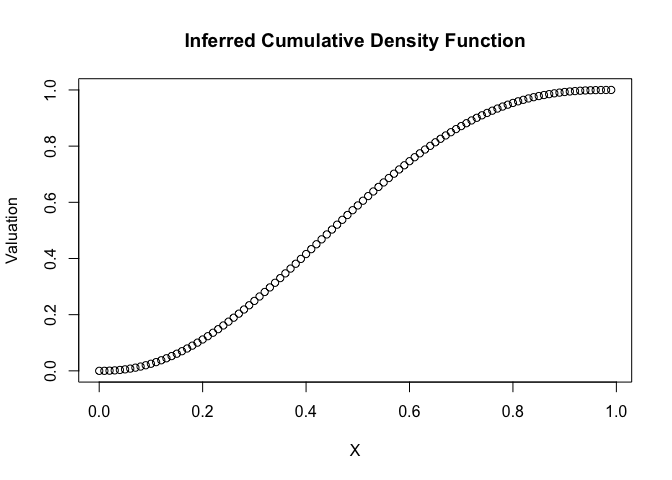
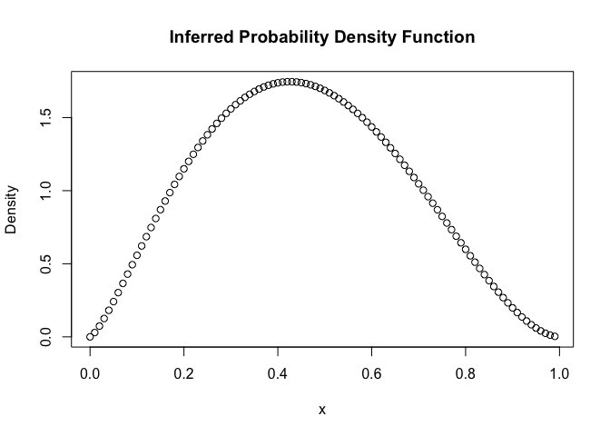

<style>
body {
text-align: justify}
</style>

#Inferred Beta Distribution Model

This is a model for utility of a value based on its ranked position in a set. This model infers a beta density distribution from available values and then gives utility based on a CDF. It means we are making valuations fully based on where we think a value sits in a set of values, 80th percentile or 50th and so on. The key insight is that range effects, utility based on absolute values, comes about from ranked position, but this is mis-calculated because we don't have all the information and we aggregate across what we know to fill this in. This aggregation to a beta distribution will make it easier and more efficient from a neuroscientific, information-theoretic point of view, but will mean we make mistakes that are predicted by this model and seen in previous empirical work.

### The model steps

-   get set of values
-   build distribution parameters based on value set
-   infer distribution with these parameters
-   value of X is the value of X in the cumulative density function of inferred distribution

So we begin by range transforming values ∈ X to values between 0 and 1.

As an example, I am going to do this with one set of values. Just a set of 8 values between 0 to 10: 0, 1, 3, 4, 5, 6, 7, 10

 Note that this is a negatively skewed distribution and the median is 5.

``` r
library(pracma)
library(ggplot2)
```

``` r
examplevec <- c(0, 3, 3.5, 4, 5, 6, 6.5, 10)
R <- (examplevec-min(examplevec))/(max(examplevec)-min(examplevec))
R
```

    ## [1] 0.00 0.30 0.35 0.40 0.50 0.60 0.65 1.00

Next, since we are assuming a beta distribution, the person needs *α* and <i>b</i> parameters based on choice set X.

I suggest *α* reflects the peak of the density distribution. A value for this can be developed by the mean distances from 0.5 in the range transformed distribution. 0.25 divided by this value gives a value for "flatness" of the distribution, as an *α* of 1 is a flat distribution (with <i>b</i> of 1) if the mean distance from the median is 0.25. In other words, *α* = 1 if there is values are equally spread across the distribution space, *α* &gt; 1 if there is a peak within the distribution, and *α* &lt; 1 if the distribution are clustered away from the middle. This is then multiplied by a sensitivity parameter *γ*. Think of *γ* as personal sensitivity to evidence of a peak. People take more convincing to believe values are more likely. There are plenty of predictions and uses to this parameter that will be discussed elsewhere.

The <i>b</i> parameter then is proposed to reflect the skewness of the distribution as the amount that it is higher or lower than *α* creates a more negative or positively skewed Beta distribution. The skewness of the distribution can be calculated through the sum of the differences to the median (0.5) ∈ X. If this sum is positive the skew is negative and vice versa. Alpha minus this sum times a sensitivity parameter *δ* gives us a value for the inferred ratio of <i>b</i> to *α*. This times *α* gives a <i>b</i> value that is, simply, a ratio of alpha given the skew of the choice set.

Below, see the example for *α* and <i>b</i> calculation for the previous example of values. Note that *γ* and *δ* are held at two and one.

``` r
gamma <- 2
delta <- 1
alpha <- (0.25/(sum(sqrt((0.5 - R)^2))/8))*gamma
alpha
```

    ## [1] 2.352941

``` r
beta <- alpha*((1 + (sum(0.5-R)))*delta)
beta
```

    ## [1] 2.823529

From these calculations so far, we can develop an inferred density distribution for the choice set. This is assumed here to be a Beta distribution, fx(x), based on a Beta density function denoted by *β*(*α*, <i>b</i>). This is mainly for logistical reasons as it is easy to visualise, although the predictions given from this restriction to a uniform, mostly single-peak, distribution like this are remarkably good as explanations of a number of heuristic problems people show when evaluating set. Predictions from this restriction to Beta distribution also explain a number of range effects, this will be discussed later on. The formula for Beta and then the probability density function is given below.

The probability density function is not too useful for deriving value judgements though. The cumulative density function, F(x), gives the percentile of x ∈ X. Therefore, the utility, U(x), is given by an integral of 0 to x of the probability density function (the cumulative density function).

 See the example below that creates a valuation function for the previous values explored.

``` r
betafunction <- function(x)(x^(alpha-1))*((1-x)^(beta-1))
betaconstant <- integral(betafunction, 0, 1)
betaconstant
```

    ## [1] 0.06561614

``` r
pdf <- function(x)(1/betaconstant)*(x^(alpha-1))*((1-x)^(beta-1))
valuation <- function(x)integral(pdf, 0, x)
valuation(1)
```

    ## [1] 1

``` r
#Note that valuation integrates to 1, so suggests it works as it should

valuation(0.5)
```

    ## [1] 0.5888409

``` r
valuation(R[7])
```

    ## [1] 0.8137618

``` r
#Valuation of 0.65 in a vector gives us an overestimation of value
#this is as rank-based utility expects 
```

We can see from simply eyeballing these values that they look very similar to predictions from RFT. It can be further explored what this means for a range of effects. This will be done in time.

``` r
vec <- seq(0,0.99,0.01)
values <- c()
for(i in 1:100){
  values <- c(values, valuation(vec[i]))
}

plot(vec, values, main="Inferred Cumulative Density Function",
ylab="Valuation", xlab = "X")
```



``` r
values <- c()
for(i in 1:100){
  values <- c(values, pdf(vec[i]))
}
plot(vec, values, main="Inferred Probability Density Function",
ylab="Density", xlab = "x")
```



So, what does this model actually bring to the table and what predictions does it make? Below are a list of why this model holds explanatory power and some expected and unique predictions made by it.

### Advantages of this model

-   applies to continous variables, so gives a prediction on how people make valuations across whole value space
-   acknowledges effects of noise/uncertainty as noise may lead to a lower gamma as trust in evidence or sample space goes down and therefore use of samples seen so far is minimised
-   acknowledges another form of range effects through the evidence being equally spaced and leading to a uniform distribution
-   the range effects shown by Tripp and Brown through SIMPLE where high values are overvalued are seen but only through the largest and smallest values changing the sample space that the distribution is over - naturally if just the highest gets raised by a large amount the person infers more of a negative skew and this leads to undervaluing higher values compared to when there is a lower maximum number, range effects therefore are due to misinterpreting the density function
-   gives us a process explanation of how people may come to build the value functions that Bhui and Ghershman (2018) suggest are optimal
-   covers personal disposition towards "range effects" through gamma and delta but through assuming personal sensitivities which offers a process explanation of why some people may be more succeptible to them

### Predictions of this model

-   as N increases, converge towards fully rank-based
-   with smaller N, range likely to be more influential only by virtue of range-setting values having more influence on alpha and beta
-   separates skewness and peakness as too sensitivities, which speaks to intuition that people may do different things with their samples but ultimately all map values to a shape
-   bimodal vs unimodal samples generate rank effects and it is suggested that this is through unimodal samples creating a more extreme peak adnd therefore underrating low values and overrating low values compared to a bimodal sample

Not sure how it deals with uncertain value spaces, where the boundaries are changing or may change. This is because everything gets range transformed. The model supposes the boundaries simply get moved but there is the phenomenon of people ignoring new evidence outside what they thought the distribution was. So, perhaps there is a model of the previous part of the process where samples get filtered into this particular sample when they are similar enough etc. For example wages getting filtered into relatively similar wages and relatively simple jobs.

PS. will flesh out some of these predictions (comparing unimodal and bimodal samples) and check code is doing exactly what I think it is.
